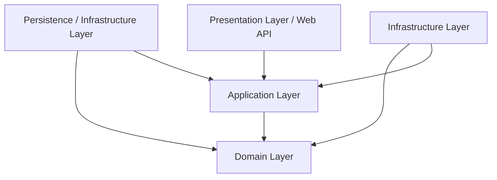

# TÀI LIỆU THIẾT KẾ BACKEND .NET CORE CHO HỆ THỐNG FLOWSPACE

Tài liệu này trình bày thiết kế kiến trúc Backend hoàn chỉnh cho hệ thống FlowSpace, sử dụng **.NET 8 (Core) Web API** kết hợp các công nghệ, thư viện hàng đầu thế giới để đáp ứng đầy đủ yêu cầu nghiệp vụ từ tài liệu phân tích frontend.

---

# 1. Kiến trúc Hệ thống (Architecture - Clean Architecture)

Hệ thống được thiết kế theo mô hình **Clean Architecture** để đảm bảo tính độc lập, khả năng kiểm thử (testability), tính mô-đun hóa, và dễ dàng bảo trì mở rộng.



### Các phân lớp chính trong Solution:

1. **Domain Layer (Core)**:
   - Là hạt nhân của hệ thống, không phụ thuộc vào bất kỳ thư viện hay framework bên ngoài nào.
   - Chứa các thực thể (Entities), Value Objects, Domain Exceptions, Interfaces cho Repository, Domain Events.
2. **Application Layer**:
   - Chứa logic nghiệp vụ ứng dụng (Use Cases), DTOs (Data Transfer Objects), Validation rules, Mapping profiles.
   - Triển khai mô hình **CQRS (Command Query Responsibility Segregation)** thông qua thư viện **MediatR**.
   - Phụ thuộc hoàn toàn vào Domain Layer.
3. **Infrastructure Layer**:
   - Chứa các dịch vụ tương tác với bên ngoài như Email Service, File Storage (S3/Local), SMS Service, System Clock.
4. **Persistence Layer**:
   - Triển khai kết nối cơ sở dữ liệu qua **Entity Framework Core (EF Core)**.
   - Chứa DbContext, triển khai các Repository Interfaces, Migrations, và Seed Data.
5. **Presentation Layer (Web API)**:
   - Điểm vào của ứng dụng, chứa các Controller (hoặc Minimal APIs), Swagger setup, Middleware xử lý Exception, JWT Authentication, và SignalR Hubs.

---

# 2. Cấu trúc Thư mục Solution (Folder Tree)

Dưới đây là cấu trúc thư mục của Solution `.sln` chuẩn hóa cho .NET Core:

```text
FlowSpace.Backend/
├── FlowSpace.sln
├── src/
│   ├── FlowSpace.Domain/
│   │   ├── Entities/
│   │   │   ├── User.cs
│   │   │   ├── Project.cs
│   │   │   ├── TaskItem.cs
│   │   │   ├── Request.cs
│   │   │   ├── Approval.cs
│   │   │   └── ...
│   │   ├── Enums/
│   │   │   ├── UserRole.cs
│   │   │   ├── TaskStatus.cs
│   │   │   └── RequestType.cs
│   │   ├── Exceptions/
│   │   └── Interfaces/
│   │       ├── IUnitOfWork.cs
│   │       └── IGenericRepository.cs
│   │
│   ├── FlowSpace.Application/
│   │   ├── Behaviors/
│   │   │   ├── ValidationBehavior.cs
│   │   │   └── LoggingBehavior.cs
│   │   ├── Common/
│   │   │   ├── Dtos/
│   │   │   └── Mappings/
│   │   ├── Features/
│   │   │   ├── Projects/
│   │   │   │   ├── Commands/
│   │   │   │   │   ├── CreateProjectCommand.cs
│   │   │   │   │   └── CreateProjectCommandValidator.cs
│   │   │   │   └── Queries/
│   │   │   │       └── GetProjectsListQuery.cs
│   │   │   ├── Tasks/
│   │   │   ├── Requests/
│   │   │   └── Users/
│   │   └── Interfaces/
│   │       ├── ICurrentUserService.cs
│   │       └── IFileStorageService.cs
│   │
│   ├── FlowSpace.Persistence/
│   │   ├── Contexts/
│   │   │   └── FlowSpaceDbContext.cs
│   │   ├── Repositories/
│   │   │   ├── GenericRepository.cs
│   │   │   └── UnitOfWork.cs
│   │   ├── Migrations/
│   │   └── Seeders/
│   │       └── DbSeeder.cs
│   │
│   ├── FlowSpace.Infrastructure/
│   │   ├── Services/
│   │   │   ├── FileStorageService.cs
│   │   │   ├── EmailSender.cs
│   │   │   └── DateTimeService.cs
│   │   └── Caching/
│   │       └── RedisCacheService.cs
│   │
│   └── FlowSpace.WebApi/
│       ├── Controllers/
│       │   ├── AuthController.cs
│       │   ├── ProjectsController.cs
│       │   ├── TasksController.cs
│       │   ├── RequestsController.cs
│       │   └── ChatController.cs
│       ├── Hubs/
│       │   ├── ChatHub.cs
│       │   └── NotificationHub.cs
│       ├── Middlewares/
│       │   └── GlobalExceptionMiddleware.cs
│       ├── Program.cs
│       └── appsettings.json
└── tests/
    ├── FlowSpace.Application.UnitTests/
    └── FlowSpace.WebApi.IntegrationTests/
```

---

# 3. Dependency Injection (DI)

Đăng ký DI trong `Program.cs` hoặc các Extension Methods cho từng Layer:

### 1. Persistence Layer DI (`FlowSpace.Persistence`)
```csharp
public static class DependencyInjection
{
    public static IServiceCollection AddPersistence(this IServiceCollection services, IConfiguration configuration)
    {
        services.AddDbContext<FlowSpaceDbContext>(options =>
            options.UseNpgsql(configuration.GetConnectionString("DefaultConnection"),
                b => b.MigrationsAssembly(typeof(FlowSpaceDbContext).Assembly.FullName)));

        services.AddScoped(typeof(IGenericRepository<>), typeof(GenericRepository<>));
        services.AddScoped<IUnitOfWork, UnitOfWork>();
        return services;
    }
}
```

### 2. Application Layer DI (`FlowSpace.Application`)
```csharp
public static class DependencyInjection
{
    public static IServiceCollection AddApplication(this IServiceCollection services)
    {
        services.AddMediatR(cfg => cfg.RegisterServicesFromAssembly(Assembly.GetExecutingAssembly()));
        services.AddValidatorsFromAssembly(Assembly.GetExecutingAssembly());
        services.AddTransient(typeof(IPipelineBehavior<,>), typeof(ValidationBehavior<,>));
        services.AddTransient(typeof(IPipelineBehavior<,>), typeof(LoggingBehavior<,>));
        services.AddAutoMapper(Assembly.GetExecutingAssembly());
        return services;
    }
}
```

### 3. Infrastructure Layer DI (`FlowSpace.Infrastructure`)
```csharp
public static class DependencyInjection
{
    public static IServiceCollection AddInfrastructure(this IServiceCollection services, IConfiguration configuration)
    {
        services.AddTransient<IDateTime, DateTimeService>();
        services.AddTransient<IFileStorageService, FileStorageService>();
        services.AddTransient<IEmailSender, EmailSender>();
        
        // Cache
        services.AddStackExchangeRedisCache(options => {
            options.Configuration = configuration.GetConnectionString("Redis");
        });
        return services;
    }
}
```

---

# 4. Authentication & Authorization

### Cơ chế JWT & Refresh Token
1. **JWT Access Token**:
   - Thời gian tồn tại: **15 phút**.
   - Chứa các Claims bảo mật: `Sub` (UserId), `Email`, `Role` (Employee/TeamLead/Manager/Director), `Jti` (Unique ID token).
2. **Refresh Token**:
   - Sinh chuỗi ngẫu nhiên dạng Crypto Secure String.
   - Lưu trữ vào Database thuộc thực thể `UserRefreshToken` kèm thời gian hết hạn (7 ngày), đánh dấu `IsRevoked` và `IsUsed`.
   - Flow lấy Access Token mới qua API `/api/v1/auth/refresh-token` sử dụng cả Access Token hết hạn và Refresh Token hợp lệ.

### Phân quyền dựa trên Policy (Policy-Based Authorization)
Hệ thống sử dụng các Policy định nghĩa mức truy cập tài nguyên:
* **`RequireDirectorPolicy`**: Yêu cầu Role là `Director`.
* **`RequireManagerPolicy`**: Yêu cầu Role là `Director` hoặc `Manager`.
* **`RequireTeamLeadPolicy`**: Yêu cầu Role là `Director`, `Manager` hoặc `TeamLead`.
* **`ProjectMemberPolicy`**: Quyền động (Resource-Based Authorization) yêu cầu người dùng phải thuộc danh sách `Members` của dự án để thao tác trên dự án/task.

```csharp
// Đăng ký Policies trong Program.cs
services.AddAuthorization(options =>
{
    options.AddPolicy("DirectorOnly", policy => policy.RequireRole("Director"));
    options.AddPolicy("ManagerOrAbove", policy => policy.RequireRole("Director", "Manager"));
    options.AddPolicy("TeamLeadOrAbove", policy => policy.RequireRole("Director", "Manager", "TeamLead"));
});
```

---

# 5. Thiết kế Database: Entity, Relationship, Migration, Seed

### Bản đồ quan hệ thực thể (EF Core Entity Configurations)
1. **User - Project (M-M)**:
   - Thông qua thực thể trung gian `ProjectMember` chứa `ProjectId` và `UserId`.
2. **Project - Task (1-M)**:
   - Một `Project` chứa nhiều `TaskItem`. Cấu hình Cascade Delete: Xóa dự án sẽ tự động xóa tất cả công việc con.
3. **Task - Subtask (1-M)**:
   - Một `TaskItem` chứa danh sách `Subtask` tự trị.
4. **Task - Task (M-M tự tham chiếu)**:
   - Thông qua bảng liên kết `TaskDependency` thể hiện mối quan hệ phụ thuộc công việc (Task này phụ thuộc Task kia để vẽ Gantt Chart).
5. **Request - Approval (1-M)**:
   - Một `Request` chứa chuỗi các bước duyệt `Approval`.

### Migration & Seeding chiến lược
* **Migrations**: EF Core Migration được quản lý tại dự án `FlowSpace.Persistence`. Chạy command `dotnet ef migrations add InitialCreate --project FlowSpace.Persistence --startup-project FlowSpace.WebApi` để biên dịch SQL Server/PostgreSQL Schema.
* **DbSeeder**:
   - Tự động chạy `context.Database.Migrate()` khi khởi động ứng dụng Presentation.
   - Chèn dữ liệu mặc định (Seed Data) cho 6 nhân viên mẫu từ `seed-data.js` kèm mật khẩu đã được băm bằng `BCrypt` hoặc `PBKDF2`, các kênh chat chung và cấu hình mẫu của công ty nếu cơ sở dữ liệu trống.

---

# 6. Repository, Service, Unit of Work Patterns

Sự kết hợp giữa Repository Pattern và Unit of Work để trừu tượng hóa giao dịch cơ sở dữ liệu và bảo đảm tính toàn vẹn (ACID):

### Interface Generic Repository (`IGenericRepository`)
```csharp
public interface IGenericRepository<T> where T : class
{
    Task<T?> GetByIdAsync(object id);
    Task<IEnumerable<T>> GetAllAsync();
    IQueryable<T> GetQueryable();
    Task AddAsync(T entity);
    void Update(T entity);
    void Delete(T entity);
}
```

### Interface Unit of Work (`IUnitOfWork`)
```csharp
public interface IUnitOfWork : IDisposable
{
    IGenericRepository<T> Repository<T>() where T : class;
    Task<int> SaveChangesAsync(CancellationToken cancellationToken = default);
    Task BeginTransactionAsync();
    Task CommitTransactionAsync();
    Task RollbackTransactionAsync();
}
```

---

# 7. Thiết kế API: RESTful & Swagger

* **RESTful Standards**:
  - URLs viết thường, sử dụng số nhiều danh từ đại diện tài nguyên (e.g. `/api/v1/projects`, `/api/v1/tasks/{id}`).
  - HTTP Methods chuẩn: `GET` (đọc), `POST` (tạo mới), `PUT` (cập nhật toàn bộ), `PATCH` (cập nhật một phần trạng thái), `DELETE` (xóa).
  - Trả về cấu trúc JSON phản hồi tiêu chuẩn:
    ```json
    {
      "success": true,
      "message": "Project created successfully",
      "data": { ... }
    }
    ```
* **Swagger/OpenAPI Setup**:
  - Sử dụng thư viện `Swashbuckle.AspNetCore` để tự động tạo tài liệu.
  - Cấu hình hỗ trợ truyền JWT Token trên giao diện Swagger bằng nút `Authorize` (Security Definition OAuth2 Bearer).
  - Tách nhóm API theo version (`v1`, `v2`) bằng group naming.

---

# 8. Cơ chế Validation (FluentValidation)

Ứng dụng thư viện **FluentValidation** tích hợp thông qua MediatR Pipeline Behavior. Mọi Request (Command) gửi đi sẽ tự động đi qua Validator trước khi thực thi nghiệp vụ chính.

### Ví dụ về Validator tạo Task:
```csharp
public class CreateTaskCommandValidator : AbstractValidator<CreateTaskCommand>
{
    public CreateTaskCommandValidator()
    {
        RuleFor(x => x.Title)
            .NotEmpty().WithMessage("Tiêu đề công việc không được để trống")
            .MaximumLength(250).WithMessage("Tiêu đề không được vượt quá 250 ký tự");

        RuleFor(x => x.ProjectId)
            .NotEmpty().WithMessage("Dự án liên kết bắt buộc phải được chọn");

        RuleFor(x => x.DueDate)
            .GreaterThan(x => x.StartDate)
            .WithMessage("Hạn hoàn thành công việc phải lớn hơn ngày bắt đầu");

        RuleFor(x => x.EstimatedHours)
            .GreaterThanOrEqualTo(0).WithMessage("Số giờ ước tính phải lớn hơn hoặc bằng 0");
    }
}
```

---

# 9. Exception Handling & Logging (Serilog)

### Middleware xử lý lỗi toàn cục (Global Exception Middleware)
Tất cả các ngoại lệ không được bắt trong Controller sẽ trôi ra Middleware. Middleware chuyển đổi Exception thành định dạng JSON chuẩn với mã lỗi tương đương:
- `NotFoundException` -> HTTP `404 Not Found`
- `ValidationException` -> HTTP `400 Bad Request` (trả về danh sách chi tiết các trường bị lỗi validation)
- `UnauthorizedAccessException` -> HTTP `401 Unauthorized` / `403 Forbidden`
- Lỗi không xác định -> HTTP `500 Internal Server Error` (ẩn chi tiết stacktrace ở môi trường Production).

### Logging cấu hình bởi Serilog
- Ghi nhật ký vào cả **Console** và các tệp tin dạng cuộn (**Rolling Files** theo ngày) trong thư mục `/logs`.
- Cấu hình gửi các log ở mức `Critical` hoặc `Error` đến các dịch vụ giám sát tập trung như **Seq**, **ElasticSearch** hoặc **Telegram/Slack Webhook**.

---

# 10. Caching Strategy (MemoryCache & Redis)

Hệ thống áp dụng cơ chế Caching 2 lớp để tăng tốc độ phản hồi:

1. **In-Memory Cache (Lớp 1 - Bộ nhớ đệm cục bộ Web API)**:
   - Áp dụng cho các dữ liệu ít thay đổi và truy vấn cực kỳ thường xuyên: Settings công ty, SLA, workflow rules, danh mục categories.
2. **Distributed Cache - Redis (Lớp 2 - Bộ nhớ đệm phân tán)**:
   - Áp dụng cho dữ liệu phiên làm việc (Session token verification), danh sách chat messages cũ, danh sách thông báo chưa đọc của từng User (`fs_notifs_<userId>`).
   - Sử dụng cơ chế **Cache Aside Pattern**: Khi Query yêu cầu thông tin -> Tìm ở Redis -> Nếu không có (Cache Miss) -> Truy vấn DB -> Đẩy lại vào Redis kèm TTL (Time To Live - e.g. 30 phút) -> Trả về Client.
   - Khi có thay đổi dữ liệu (Command) -> Xóa Cache tương ứng ngay lập tức (Cache Eviction) để bảo đảm tính nhất quán.

---

# 11. SignalR (Realtime Notification & Chat)

### Hubs phục vụ kết nối trực tiếp
1. **`ChatHub`**:
   - Đảm nhiệm việc truyền nhận tin nhắn trực tiếp giữa các Client đang mở tab Chat.
   - Khi Client gửi tin nhắn -> Ghi vào database -> Phát sự kiện `ReceiveMessage` đến tất cả thành viên trong Channel hoặc cụ thể cho ConnectionId của đối tác chat (nếu là Direct Message).
   - Truyền nhận các sự kiện real-time khác: `TypingStatus`, `ReactionAdded`, `MessageRecalled` (thu hồi).
2. **`NotificationHub`**:
   - Dùng để gửi thông báo tức thì đến người dùng từ các tác vụ ngầm.
   - Giao việc mới -> Server push tin nhắn "Nhiệm vụ mới" -> Client hiển thị thông báo góc màn hình mà không cần load lại trang.

---

# 12. Quản lý Tệp tin (Upload - Image & Document)

* **Controller Upload**: Cung cấp API `POST /api/v1/documents/upload` chấp nhận kiểu dữ liệu `MultipartFormData`.
* **Cơ chế Lưu trữ (File Storage abstraction)**:
  - Định nghĩa interface `IFileStorageService` với các phương thức `UploadFileAsync()`, `DownloadFileAsync()`, `DeleteFileAsync()`.
  - Môi trường Development: Sử dụng **Local File Storage Service** (lưu file trực tiếp vào thư mục `/wwwroot/uploads` trên đĩa).
  - Môi trường Production: Sử dụng **S3 File Storage Service** (lưu tệp tin lên AWS S3 hoặc MinIO) để đảm bảo khả năng co giãn ngang (scaling).
* **Kiểm tra an toàn file (Security Checks)**:
  - Giới hạn dung lượng tối đa (e.g. Image < 5MB, Document < 50MB).
  - Kiểm tra đuôi file (Extension Whitelist) và chữ ký byte của file (Magic Numbers) để loại bỏ các tệp thực thi nguy hại (.exe, .bat, .sh).

---

# 13. Quy trình Động & Công cụ Phê duyệt (Workflow/Approval Engine)

Đây là xương sống xử lý nghiệp vụ các yêu cầu có tính chất phê duyệt của doanh nghiệp.

### Thuật toán xác định luồng phê duyệt tự động
```csharp
public async Task<List<ApprovalStep>> GenerateApprovalStepsAsync(Request request)
{
    var steps = new List<ApprovalStep>();
    var rules = await _unitOfWork.Repository<WorkflowRule>().GetAllAsync();
    
    // 1. Phân tích giá trị số tiền hoặc số ngày nghỉ từ tiêu đề và mô tả
    decimal requestValue = ExtractNumericValue(request.Title, request.Description);
    
    // 2. Tìm kiếm rule khớp loại yêu cầu và có giá trị lớn hơn hoặc bằng hạn mức cấu hình
    var matchedRule = rules
        .Where(r => r.RequestType == request.Type && r.IsActive)
        .OrderByDescending(r => r.Value)
        .FirstOrDefault(r => requestValue >= r.Value);

    // 3. Xác định vai trò phê duyệt cao nhất yêu cầu
    string maxRoleRequired = matchedRule != null ? matchedRule.MaxRole : "team_lead";

    // 4. Sinh chuỗi phê duyệt tuần tự dựa trên cấu hình workflow chung của công ty
    var defaultWorkflow = await _unitOfWork.Repository<CompanyWorkflow>()
        .GetFirstOrDefaultAsync(w => w.RequestType == request.Type);

    foreach (var role in defaultWorkflow.Steps)
    {
        steps.Add(new ApprovalStep {
            Level = steps.Count + 1,
            Role = role,
            Status = ApprovalStatus.Pending
        });

        // Dừng thêm bước nếu bước vừa thêm đã đạt vai trò cao nhất yêu cầu theo hạn mức
        if (role == maxRoleRequired)
            break;
    }
    
    return steps;
}
```

### Xử lý Phê duyệt Vượt cấp & Tự động duyệt
- **Auto-Approve**: Nếu người thực hiện duyệt hiện tại có quyền hạn tương đương hoặc lớn hơn vai trò cuối cùng cần duyệt trong chuỗi, hệ thống sẽ tự động duyệt tất cả các bước trung gian còn lại.
- **SLA Tracking**: Khi một bước chuyển sang `Pending`, hệ thống tạo một Scheduler task (sử dụng **Hangfire**). Nếu sau số giờ quy định trong `fs_sla_settings` bước đó chưa được xử lý, một Notification quá hạn sẽ được bắn đến Approver hiện tại và chuyển email báo cáo lên cấp quản lý cao hơn.
