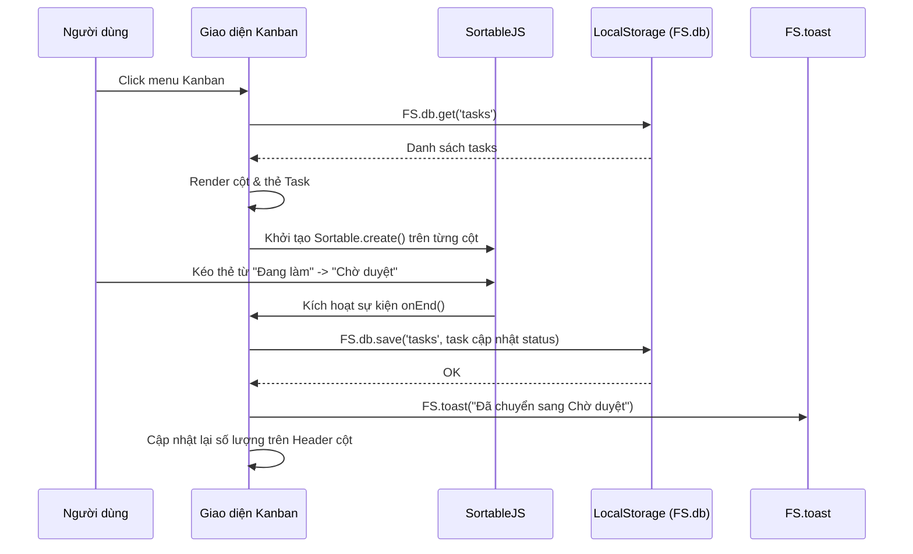
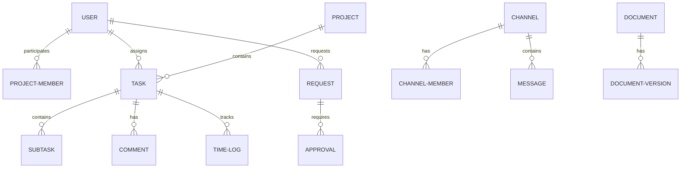

# TÀI LIỆU PHÂN TÍCH TOÀN DIỆN FRONTEND FLOWSPACE

Tài liệu này được biên soạn bởi Senior Solution Architect & Tech Lead trên cơ sở phân tích 100% mã nguồn Frontend hiện tại của dự án FlowSpace.

---

# 1. Tổng quan hệ thống

### Ứng dụng dùng để làm gì?
**FlowSpace** là một không gian làm việc tối giản (Notion-Style Workspace) và tập trung dành cho các đội ngũ hiệu suất cao. Nó kết hợp nhiều công cụ quản lý dự án, công việc và cộng tác nhóm trong một giao diện duy nhất, giúp doanh nghiệp tối ưu hóa quy trình làm việc và giảm thiểu thời gian họp hành không cần thiết.

### Các module chính trong hệ thống
1. **Tổng quan (Overview/Dashboard)**: Hiển thị các chỉ số KPI, hiệu suất làm việc, dự án đang chạy, công việc cá nhân, và các hoạt động gần đây.
2. **Quản lý công việc (Work/Task Management)**:
   - **Dự án (Projects)**: Xem danh sách dự án, tiến độ, thành viên, trạng thái và chỉnh sửa thông tin dự án.
   - **Công việc (Tasks)**: Quản lý chi tiết công việc với trạng thái, độ ưu tiên, ngày bắt đầu/hạn hoàn thành, subtasks, tags, phân công, và bình luận.
   - **Bảng Kanban (Kanban Board)**: Kéo thả trực quan để di chuyển trạng thái công việc sử dụng SortableJS.
   - **Biểu đồ Gantt (Gantt Chart)**: Trực quan hóa timeline dự án và công việc trên calendar, hỗ trợ kéo thả dịch chuyển thời gian của task và vẽ đường găng (critical path) cùng mối quan hệ phụ thuộc (dependencies).
   - **Lịch biểu (Calendar)**: Tích hợp FullCalendar để hiển thị deadline công việc và các cuộc họp nội bộ.
   - **Time Tracking**: Bấm giờ chạy thời gian thực hoặc ghi nhận giờ làm tay (manual log) gắn với từng công việc, tổng hợp thời gian làm việc bằng biểu đồ.
3. **Cộng tác (Collaboration)**:
   - **Chat nội bộ (Chat & DM)**: Trao đổi theo kênh chung hoặc nhắn tin riêng (Direct Messages), cho phép ghim tin nhắn, nhắc tên (@mention), bình luận, trả lời (reply) và biểu cảm bằng emoji.
   - **Tài liệu (Documents)**: Lưu trữ tài liệu dưới dạng cây thư mục (Notion-style), cho phép phân quyền chia sẻ, lưu lịch sử phiên bản và khôi phục về phiên bản cũ.
4. **Quy trình & Yêu cầu (Request & Approval Workflow)**:
   - **Yêu cầu (Requests)**: Nhân viên tạo yêu cầu (Xin nghỉ phép, tăng ca, mua sắm thiết bị, làm remote...).
   - **Phê duyệt (Approvals)**: Trưởng nhóm, Trưởng phòng, Ban Giám đốc kiểm duyệt yêu cầu theo phân cấp hạn mức động (Workflow Engine).
5. **Hệ thống & Quản trị (Admin & Logs)**:
   - **Báo cáo (Reports)**: Báo cáo hiệu suất, tiến độ dự án, giờ làm thành viên, hỗ trợ xuất Excel/PDF/CSV.
   - **Quản lý Người dùng (Users)**: Xem danh sách nhân viên, thông tin phòng ban, số giờ làm và số công việc hoàn thành.
   - **Nhật ký hệ thống (System Logs)**: Theo dõi vết hành vi người dùng (Đăng nhập, tạo dự án, duyệt yêu cầu, comment...).
   - **Cài đặt (Settings)**: Thay đổi giao diện (Dark mode), chỉnh sửa cấu hình danh mục, thiết lập hạn mức duyệt tự động, cấu hình thời hạn SLA và chỉnh sửa các mẫu thông báo tự động.

### Luồng hoạt động chính (Workflow)
* **Đăng nhập & Cấp quyền**: Người dùng đăng nhập vào hệ thống -> Hệ thống tải dữ liệu LocalStorage phù hợp với ID -> Phân cấp menu sidebar theo vai trò người dùng (Employee, Team Lead, Manager, Director).
* **Vận hành công việc**: Tạo dự án -> Tạo task -> Assign -> Bắt đầu timer -> Cập nhật trạng thái trên Kanban/Gantt -> Comment/Subtask -> Đóng công việc -> Log time lưu trữ.
* **Quy trình Phê duyệt**: Tạo Request -> Áp dụng Workflow Rule (ví dụ: mua sắm > 10 triệu cần Giám đốc duyệt, nghỉ phép > 3 ngày cần Trưởng phòng duyệt) -> Tạo các bước Approval tương ứng -> Cấp duyệt nhận notification và duyệt/từ chối trên trang Approvals.

### Vai trò người dùng (Roles & Permissions)
Hệ thống phân cấp theo thang điểm quyền lực `ROLE_LEVELS`:
* **Employee (Cấp 1)**: Xem/Chỉnh sửa task được giao, chat, tải tài liệu cá nhân/được chia sẻ, gửi yêu cầu cá nhân, thực hiện Time Tracking cá nhân. Không truy cập được Gantt Chart, Approvals, Reports, Users, Logs.
* **Team Lead (Cấp 2)**: Toàn bộ quyền Employee + Truy cập Gantt Chart, duyệt các yêu cầu cấp 1 trên trang Approvals, tạo dự án/công việc mới.
* **Manager (Cấp 3)**: Toàn bộ quyền Team Lead + Xem trang Báo cáo (Reports), xem các tab cấu hình hệ thống (Categories, Workflows, SLA, Templates) trong Settings.
* **Director (Cấp 4)**: Cấp tối cao. Toàn bộ quyền Manager + Quản lý Người dùng (Users), xem Nhật ký hệ thống (Logs), reset toàn bộ dữ liệu.

---

# 2. Phân tích toàn bộ pages

| Tên page | Đường dẫn | Mục đích | Các chức năng chính | Các button chính | Các modal | Các event chính | Validations | Các API Backend cần có |
| :--- | :--- | :--- | :--- | :--- | :--- | :--- | :--- | :--- |
| **Landing** | `index.html` | Giới thiệu sản phẩm và điều hướng vào demo app | Trình chiếu các tính năng, triết lý thiết kế, slide trình bày tự động xoay | `Vào Demo App`, `Tìm hiểu thêm`, Indicator slide | Không | Click chọn slide, Auto-rotation carousel (7s) | Không | Không cần (Tĩnh) |
| **Đăng nhập** | `login.html` | Xác thực người dùng truy cập hệ thống | Điền nhanh tài khoản demo, nhập email/mật khẩu để đăng nhập | `Đăng nhập`, các nút điền nhanh tài khoản demo, nút bật/tắt hiển thị mật khẩu | Không | Form submit, click tài khoản demo, toggle password show/hide | Điền đầy đủ email/mật khẩu, kiểm tra tồn tại tài khoản | `POST /api/auth/login` |
| **App Shell** | `app.html` | Bố cục chính (Sidebar, Topbar) chứa nội dung SPA | Định tuyến SPA, hiển thị thông tin user đăng nhập, thanh tìm kiếm toàn cục, nút thông báo, logout | Logout, Search Trigger, Notification bell, Sidebar Collapse | `Global Search` (Tìm kiếm toàn cục) | Click chuyển page (Sidebar), popstate browser, toggle user menu, logout, search | Không | `POST /api/auth/logout`, `GET /api/notifications/unread-count`, `GET /api/search?q=...` |
| **Dashboard** | `pages/dashboard.html` | Tổng quan hiệu suất công việc và dự án | Hiển thị widget thống kê dự án, công việc quá hạn, biểu đồ tiến độ dự án (Chart.js), việc cần làm hôm nay, nhật ký hoạt động | Link xem chi tiết task/dự án | Không | Click vào task/dự án trong dashboard | Không | `GET /api/dashboard/stats`, `GET /api/dashboard/recent-activities` |
| **Dự án** | `pages/projects.html` | Quản lý vòng đời các dự án trong công ty | Tìm kiếm, lọc theo trạng thái/độ ưu tiên, xem dạng list/card, tạo/sửa dự án | `Tạo dự án`, `Lưu`, `Hủy`, `Xem chi tiết`, `Chỉnh sửa` | `Tạo/Sửa dự án` | Lọc dự án, click xem chi tiết, submit form tạo/sửa | Tên dự án là bắt buộc | `GET /api/projects`, `POST /api/projects`, `GET /api/projects/{id}`, `PUT /api/projects/{id}` |
| **Công việc** | `pages/tasks.html` | Quản lý chi tiết danh sách công việc | Phân trang, lọc, tạo/sửa task, đánh dấu hoàn thành nhanh | `Tạo công việc`, `Lưu`, `Hủy`, `Chỉnh sửa`, Checkbox hoàn thành | `Tạo/Sửa công việc` | Phân trang, check hoàn thành nhanh, lọc task, submit form | Tiêu đề và Dự án bắt buộc, số giờ ước tính phải là số | `GET /api/tasks`, `POST /api/tasks`, `GET /api/tasks/{id}`, `PUT /api/tasks/{id}`, `PATCH /api/tasks/{id}/status` |
| **Kanban** | `pages/kanban.html` | Quản lý trạng thái công việc kéo thả trực quan | Kéo thả thẻ task qua các cột (Chưa bắt đầu, Đang làm, Chờ duyệt, Hoàn thành), lọc theo dự án/nhân viên/phòng ban | `Thêm task` trên đầu cột | Không (chuyển hướng sang Tasks modal) | SortableJS `onEnd` (kéo thả thẻ), click card mở chi tiết task | Không | `GET /api/tasks/kanban`, `PATCH /api/tasks/{id}/status` |
| **Gantt** | `pages/gantt.html` | Quản lý tiến độ dự án trên dòng thời gian | Hiển thị timeline dự án và task dạng thanh bar, kéo ngang để chuyển ngày, vẽ đường găng và dependency | Nút phóng to `week`/`month`, Lọc dự án | Không | Drag-and-drop bar (di chuyển ngày bắt đầu/kết thúc), hover bar, scroll timeline | Ngày bắt đầu phải trước ngày kết thúc | `GET /api/gantt-chart`, `PATCH /api/tasks/{id}/dates` |
| **Lịch biểu** | `pages/calendar.html` | Xem hạn công việc và cuộc họp trên lịch | Tích hợp FullCalendar, lọc theo dự án, hiển thị deadline task và lịch họp | `Hôm nay`, `Tháng`, `Tuần`, `Ngày` | Không (mở Task Detail offcanvas) | Click event trên lịch | Không | `GET /api/calendar/events` |
| **Time Tracking** | `pages/timetracking.html` | Quản lý thời gian thực hiện công việc | Đếm giây chạy nền, tạm dừng, log giờ làm thủ công, vẽ biểu đồ Bar Chart giờ làm | `Bắt đầu`, `Tạm dừng`, `Tiếp tục`, `Kết thúc`, `Ghi nhận thủ công` | `Ghi nhận giờ thủ công` | Click nút đếm giờ, submit log giờ làm, xóa log | Công việc là bắt buộc, số giờ log > 0 | `GET /api/timetracking/logs`, `POST /api/timetracking/logs`, `DELETE /api/timetracking/logs/{id}` |
| **Chat** | `pages/chat.html` | Trao đổi thông tin nội bộ | Chat nhóm, chat riêng tư, search tin nhắn, ghim, reply trích dẫn, thu hồi, tag @mention | Nút ghim, Nút trả lời, Nút xóa (thu hồi), Emoji badge, Nút gửi | Không | Textarea gõ phím (Enter gửi, Shift+Enter xuống dòng, gõ `@` mở menu gợi ý), click tin nhắn ghim | Không được gửi tin nhắn trống | `GET /api/chat/channels`, `GET /api/chat/channels/{id}/messages`, `POST /api/chat/messages`, `DELETE /api/chat/messages/{id}` (thu hồi) |
| **Tài liệu** | `pages/documents.html` | Lưu trữ file và tài liệu Notion-style | Cây thư mục, tải lên file giả lập, tạo doc mới, download, phân quyền chia sẻ, khôi phục phiên bản | `Tải lên tệp`, `Tạo tài liệu mới`, `Tải xuống`, `Chia sẻ`, `Lịch sử phiên bản` | `Chia sẻ tài liệu`, `Lịch sử phiên bản`, `Preview tài liệu` | Click folder mở thư mục, tải file máy tính, restore version | Tên tài liệu bắt buộc | `GET /api/documents`, `POST /api/documents`, `DELETE /api/documents/{id}`, `GET /api/documents/{id}/versions` |
| **Yêu cầu** | `pages/requests.html` | Nộp đơn yêu cầu phê duyệt | Nhân viên gửi đơn, tự động sinh chuỗi phê duyệt theo loại, xem tiến độ | `Tạo yêu cầu`, `Lưu`, `Hủy`, `Phê duyệt`, `Từ chối` | `Tạo yêu cầu`, `Chi tiết yêu cầu` | Click item mở chi tiết, submit đơn, approve/reject | Tiêu đề bắt buộc | `GET /api/requests`, `POST /api/requests`, `GET /api/requests/{id}`, `POST /api/requests/{id}/approve` |
| **Phê duyệt** | `pages/approvals.html` | Cấp trung/cao phê duyệt các yêu cầu | Lọc yêu cầu chờ duyệt, phê duyệt nhanh hoặc từ chối nhanh | `Phê duyệt`, `Từ chối` | Không | Click nút phê duyệt/từ chối nhanh | Không | `GET /api/approvals/pending`, `POST /api/approvals/{id}/approve` |
| **Báo cáo** | `pages/reports.html` | Thống kê số liệu công ty và xuất dữ liệu | Hiển thị biểu đồ tròn trạng thái task, biểu đồ cột giờ làm nhân viên, xu hướng hoàn thành, xuất báo cáo | `Xuất Excel`, `Xuất CSV`, `Xuất PDF` | Không | Thay đổi kỳ báo cáo (tuần/tháng) | Không | `GET /api/reports/kpi-stats`, `GET /api/reports/export` |
| **Người dùng** | `pages/users.html` | Quản lý danh sách nhân sự (Giám đốc) | Xem danh sách nhân viên, phòng ban, email, tổng giờ làm, số task | Nút xem hồ sơ chi tiết | Không | Tìm kiếm nhân viên, lọc theo vai trò | Không | `GET /api/users` |
| **Nhật ký** | `pages/logs.html` | Audit log kiểm vết hoạt động (Giám đốc) | Phân trang, xem lịch sử các hoạt động kèm thông tin IP | `Làm mới` | Không | Tìm kiếm log, lọc theo loại hành động/nhân viên, phân trang | Không | `GET /api/system-logs` |
| **Cài đặt** | `pages/settings.html` | Thay đổi thiết lập cá nhân & hệ thống | Sửa profile cá nhân, chỉnh theme (Dark/Light), cấu hình categories, workflows rule, SLA, templates | `Lưu cấu hình`, `Reset dữ liệu`, các nút thêm/sửa/xóa danh mục, workflow rule | `Thêm/Sửa Danh mục`, `Thêm/Sửa Quy tắc Workflow`, `Thêm Mẫu thông báo` | Chuyển tab, chọn swatch màu, đổi font size, reset data, CRUD | Tên danh mục/quy tắc là bắt buộc | `GET /api/settings`, `PUT /api/settings`, `POST /api/settings/reset` |

---

# 3. Phân tích toàn bộ Javascript

### Cấu trúc Namespace & Global Variables
Dự án sử dụng mô hình Namespace Pattern của Javascript thuần để quản lý mã nguồn, đóng gói tất cả logic trong một biến toàn cục duy nhất là `window.FS`:
* **`FS.db`**: Mock Database Client thực hiện CRUD dữ liệu trực tiếp trên `localStorage`.
* **`FS.auth`**: Module quản lý xác thực người dùng, phiên làm việc (ở `sessionStorage`) và phân quyền.
* **`FS.date` / `FS.str` / `FS.badge`**: Các helper định dạng ngày tháng, chuỗi, và badge giao diện.
* **`FS.confirm` / `FS.toast`**: Hiển thị hộp thoại xác nhận động và thông báo nhanh.
* **`FS.router`**: Định tuyến SPA tự chế sử dụng `history.pushState` và `jQuery.load` để tải động nội dung trong thư mục `pages/` vào phần tử `#page-content`.
* **`FS.notifModule` / `FS.searchModule`**: Logic điều khiển chuông thông báo và ô tìm kiếm ở App Shell.
* **`FS.taskDetail` / `FS.projectDetail`**: Các Offcanvas component hiển thị thông tin chi tiết và thao tác nhanh đối với task và dự án từ mọi trang.
* **`FS.pages.<tên_trang>`**: Chứa logic khởi tạo `init()` và các hàm xử lý nội bộ riêng cho từng trang.

### Thư viện phụ thuộc (Dependencies)
* **jQuery (3.7.1)**: Thư viện chính để thao tác DOM, lắng nghe sự kiện, và thực hiện cơ chế tải trang AJAX (`$().load()`).
* **Bootstrap JS (5.3.3)**: Quản lý một số component cơ bản (modal, dropdown).
* **Chart.js (4.4.4)**: Vẽ biểu đồ trên Dashboard, Time Tracking và Reports.
* **FullCalendar (6.1.14)**: Xử lý hiển thị sự kiện trên trang Lịch (Calendar).
* **SortableJS (1.15.3)**: Hỗ trợ tính năng kéo thả trên bảng Kanban.
* **xlsx.full.min.js**: Thư viện JavaScript hỗ trợ xuất dữ liệu ra file Excel.
* **jspdf.umd.min.js / jspdf.plugin.autotable.min.js**: Thư viện kết xuất bảng biểu ra file PDF.

### Luồng xử lý mẫu: Mở trang Kanban và kéo thả Task


---

# 4. Phân tích LocalStorage

Hệ thống lưu trữ toàn bộ trạng thái trong `localStorage` với tiền tố là `fs_` để làm cơ sở dữ liệu giả lập. Dưới đây là danh sách chi tiết các Key và cấu trúc dữ liệu:

### Danh sách các Key trong LocalStorage

#### 1. `fs_users`
* **Mô tả**: Danh sách toàn bộ tài khoản người dùng trong hệ thống.
* **Cấu trúc**:
  ```json
  [
    {
      "id": "u1", "name": "Nguyễn Văn An", "email": "nhanvien@flowspace.demo",
      "password": "...", "role": "employee", "avatar": "NV",
      "color": "av-teal", "department": "Kỹ thuật", "position": "Nhân viên",
      "phone": "...", "joinDate": "YYYY-MM-DD", "active": true
    }
  ]
  ```

#### 2. `fs_projects`
* **Mô tả**: Thông tin các dự án của doanh nghiệp.
* **Cấu trúc**:
  ```json
  [
    {
      "id": "p1", "code": "FS-001", "name": "FlowSpace Platform v2",
      "description": "...", "status": "active", "priority": "high",
      "startDate": "ISOString", "endDate": "ISOString", "progress": 45,
      "ownerId": "u3", "members": ["u1", "u2", "u3"], "tags": ["frontend"],
      "createdAt": "ISOString"
    }
  ]
  ```

#### 3. `fs_tasks`
* **Mô tả**: Toàn bộ công việc thuộc các dự án.
* **Cấu trúc**:
  ```json
  [
    {
      "id": "t1", "code": "T-001", "title": "Thiết kế UI", "projectId": "p1",
      "assigneeId": "u6", "status": "done", "priority": "high",
      "description": "...", "startDate": "ISOString", "dueDate": "ISOString",
      "completedAt": "ISOString", "estimatedHours": 16, "loggedHours": 14,
      "tags": ["design"], "createdBy": "u3", "createdAt": "ISOString",
      "subtasks": [{ "id": "st1", "title": "Wireframe", "done": true }],
      "comments": [{ "id": "c1", "userId": "u3", "text": "...", "createdAt": "ISOString" }],
      "dependsOn": ["t2"] // Ràng buộc phụ thuộc
    }
  ]
  ```

#### 4. `fs_requests`
* **Mô tả**: Các yêu cầu xin phê duyệt của nhân viên.
* **Cấu trúc**:
  ```json
  [
    {
      "id": "r1", "type": "leave", "title": "Xin nghỉ phép", "description": "...",
      "requesterId": "u1", "status": "approved",
      "approvals": [
        { "level": 1, "role": "team_lead", "approverId": "u2", "status": "approved", "note": "OK", "updatedAt": "ISOString" }
      ],
      "createdAt": "ISOString", "updatedAt": "ISOString"
    }
  ]
  ```

#### 5. `fs_documents`
* **Mô tả**: Cây thư mục và tệp tin lưu trữ (Notion-style).
* **Cấu trúc**:
  ```json
  [
    {
      "id": "d2", "name": "Kiến trúc hệ thống", "type": "doc", "parentId": "d1", // null nếu ở Root
      "content": "...", "createdBy": "u3", "createdAt": "ISOString", "size": 45000,
      "sharedWith": ["u1", "u2"],
      "versions": [
        { "version": "1.0", "uploadedBy": "u3", "uploadedAt": "ISOString", "note": "Init" }
      ]
    }
  ]
  ```

#### 6. `fs_channels` & `fs_messages`
* **Mô tả**: Các kênh chat, nhóm chat riêng (DMs) và dữ liệu tin nhắn tương ứng.
* **Cấu trúc `fs_channels`**:
  ```json
  [
    { "id": "ch1", "name": "chung", "type": "channel", "description": "...", "members": ["u1", "u2"] }
  ]
  ```
* **Cấu trúc `fs_messages`** (Dạng Map với Key là `channelId`):
  ```json
  {
    "ch1": [
      {
        "id": "m1", "channelId": "ch1", "userId": "u4", "text": "Hi!", "createdAt": "ISOString",
        "reactions": { "heart": 3 }, "replyTo": null, "recalled": false, "pinned": false
      }
    ]
  }
  ```

#### 7. `fs_time_logs`
* **Mô tả**: Nhật ký chấm giờ làm việc của nhân viên gắn với các công việc.
* **Cấu trúc**:
  ```json
  [
    { "id": "tl1", "taskId": "t1", "userId": "u6", "projectId": "p1", "hours": 8, "date": "ISOString", "note": "Wireframe" }
  ]
  ```

#### 8. `fs_system_logs`
* **Mô tả**: Ghi vết hành động của người dùng (Audit Log).
* **Cấu trúc**:
  ```json
  [
    { "id": "sl1", "userId": "u4", "action": "LOGIN", "module": "Auth", "detail": "Thành công", "ip": "192.168.1.100", "createdAt": "ISOString" }
  ]
  ```

#### 9. `fs_settings`
* **Mô tả**: Cấu hình chung của công ty và cấu trúc quy trình duyệt mặc định.
* **Cấu trúc**:
  ```json
  {
    "company": { "name": "FlowSpace Corp", "timezone": "Asia/Ho_Chi_Minh", "language": "vi", "workingDays": [1,2,3,4,5] },
    "notifications": { "email": true, "browser": true },
    "security": { "sessionTimeout": 60 },
    "workflows": [
      { "id": "wf1", "name": "Phê duyệt nghỉ phép", "steps": ["team_lead", "manager"], "active": true }
    ]
  }
  ```

#### 10. Các Key bổ sung khác
* `fs_categories`: Chứa các danh mục động (phân loại dự án, task, yêu cầu, mức độ ưu tiên).
* `fs_workflow_rules`: Các quy tắc phân cấp duyệt tự động (Workflow engine limit rules).
* `fs_sla_settings`: Quy định thời gian SLA tối đa cho phép xử lý của từng loại yêu cầu.
* `fs_notification_templates`: Các mẫu thông báo tự động gửi qua email/hệ thống.
* `fs_notifs_<userId>`: Hộp thư thông báo cá nhân của từng user.

---

# 5. Phân tích các Thực thể (Entities)

Từ dữ liệu giả lập và các chức năng trên giao diện, chúng tôi suy luận ra mô hình thực thể (Entity Model) chuẩn hóa để phát triển cho Backend:



### Chi tiết các thuộc tính thực thể chính

#### 1. User (Người dùng)
* `Id` (String/UUID, PK, Required)
* `Name` (String, Max 100, Required)
* `Email` (String, Unique, Required, Format Email)
* `PasswordHash` (String, Required)
* `Role` (Enum: `employee`, `team_lead`, `manager`, `director`, Required)
* `Avatar` (String, Max 2)
* `Color` (String)
* `Department` (String)
* `Position` (String)
* `Phone` (String, Regex số điện thoại)
* `Active` (Boolean, Default: true)
* `JoinDate` (DateTime)

#### 2. Project (Dự án)
* `Id` (String/UUID, PK, Required)
* `Code` (String, Unique, Max 20, Required)
* `Name` (String, Max 200, Required)
* `Description` (String, Max 2000)
* `Status` (Enum: `active`, `on_hold`, `done`, Default: `active`)
* `Priority` (Enum: `low`, `medium`, `high`, Default: `medium`)
* `StartDate` (DateTime)
* `EndDate` (DateTime)
* `Progress` (Int, 0 - 100, Validation: tự động tính theo tỷ lệ hoàn thành task)
* `OwnerId` (UUID, FK -> User, Required)

#### 3. Task (Công việc)
* `Id` (String/UUID, PK, Required)
* `Code` (String, Unique, Required)
* `Title` (String, Max 250, Required)
* `Description` (String)
* `ProjectId` (UUID, FK -> Project, Required)
* `AssigneeId` (UUID, FK -> User)
* `Status` (Enum: `todo`, `in_progress`, `review`, `done`, Required)
* `Priority` (Enum: `low`, `medium`, `high`, Required)
* `StartDate` (DateTime)
* `DueDate` (DateTime, Validation: phải sau `StartDate`)
* `CompletedAt` (DateTime)
* `EstimatedHours` (Int, >= 0)
* `LoggedHours` (Float, >= 0)
* `CreatedBy` (UUID, FK -> User)
* `CreatedAt` (DateTime)

#### 4. Request (Yêu cầu)
* `Id` (UUID, PK, Required)
* `Type` (Enum: `leave`, `overtime`, `purchase`, `remote`, Required)
* `Title` (String, Max 200, Required)
* `Description` (String, Required)
* `RequesterId` (UUID, FK -> User, Required)
* `Status` (Enum: `pending`, `approved`, `rejected`, Default: `pending`)
* `CreatedAt` (DateTime)
* `UpdatedAt` (DateTime)

#### 5. Approval (Bước phê duyệt)
* `Id` (UUID, PK, Required)
* `RequestId` (UUID, FK -> Request, Required)
* `Level` (Int, >= 1, Required)
* `Role` (Enum: `team_lead`, `manager`, `director`, Required)
* `ApproverId` (UUID, FK -> User, Nullable)
* `Status` (Enum: `pending`, `approved`, `rejected`, Default: `pending`)
* `Note` (String, Max 1000)
* `UpdatedAt` (DateTime)

---

# 6. Đề xuất Database Chuẩn (Relational Database Schema)

Giải pháp đề xuất sử dụng hệ quản trị cơ sở dữ liệu quan hệ (RDBMS) như **PostgreSQL** hoặc **SQL Server**.

### Các bảng dữ liệu chính & Khóa ngoại (FK)

```sql
-- 1. Bảng Users
CREATE TABLE users (
    id UUID PRIMARY KEY DEFAULT gen_random_uuid(),
    name VARCHAR(100) NOT NULL,
    email VARCHAR(150) UNIQUE NOT NULL,
    password_hash VARCHAR(255) NOT NULL,
    role VARCHAR(20) NOT NULL CHECK (role IN ('employee', 'team_lead', 'manager', 'director')),
    avatar VARCHAR(2),
    color VARCHAR(20),
    department VARCHAR(100),
    position VARCHAR(100),
    phone VARCHAR(20),
    active BOOLEAN DEFAULT TRUE,
    join_date TIMESTAMP,
    created_at TIMESTAMP DEFAULT CURRENT_TIMESTAMP
);
CREATE INDEX idx_users_email ON users(email);

-- 2. Bảng Projects
CREATE TABLE projects (
    id UUID PRIMARY KEY DEFAULT gen_random_uuid(),
    code VARCHAR(20) UNIQUE NOT NULL,
    name VARCHAR(200) NOT NULL,
    description TEXT,
    status VARCHAR(20) DEFAULT 'active' CHECK (status IN ('active', 'on_hold', 'done')),
    priority VARCHAR(10) DEFAULT 'medium' CHECK (priority IN ('low', 'medium', 'high')),
    start_date TIMESTAMP,
    end_date TIMESTAMP,
    progress INT DEFAULT 0 CHECK (progress BETWEEN 0 AND 100),
    owner_id UUID REFERENCES users(id) ON DELETE RESTRICT,
    created_at TIMESTAMP DEFAULT CURRENT_TIMESTAMP
);
CREATE INDEX idx_projects_code ON projects(code);

-- 3. Bảng trung gian Project Members
CREATE TABLE project_members (
    project_id UUID REFERENCES projects(id) ON DELETE CASCADE,
    user_id UUID REFERENCES users(id) ON DELETE CASCADE,
    PRIMARY KEY (project_id, user_id)
);

-- 4. Bảng Tasks
CREATE TABLE tasks (
    id UUID PRIMARY KEY DEFAULT gen_random_uuid(),
    code VARCHAR(20) UNIQUE NOT NULL,
    title VARCHAR(250) NOT NULL,
    description TEXT,
    project_id UUID REFERENCES projects(id) ON DELETE CASCADE,
    assignee_id UUID REFERENCES users(id) ON DELETE SET NULL,
    status VARCHAR(20) DEFAULT 'todo' CHECK (status IN ('todo', 'in_progress', 'review', 'done')),
    priority VARCHAR(10) DEFAULT 'medium' CHECK (priority IN ('low', 'medium', 'high')),
    start_date TIMESTAMP,
    due_date TIMESTAMP,
    completed_at TIMESTAMP,
    estimated_hours INT DEFAULT 0,
    logged_hours NUMERIC(5,2) DEFAULT 0.0,
    created_by UUID REFERENCES users(id) ON DELETE SET NULL,
    created_at TIMESTAMP DEFAULT CURRENT_TIMESTAMP
);
CREATE INDEX idx_tasks_project ON tasks(project_id);
CREATE INDEX idx_tasks_assignee ON tasks(assignee_id);
CREATE INDEX idx_tasks_status ON tasks(status);

-- 5. Bảng Task Dependencies
CREATE TABLE task_dependencies (
    task_id UUID REFERENCES tasks(id) ON DELETE CASCADE,
    depends_on_task_id UUID REFERENCES tasks(id) ON DELETE CASCADE,
    PRIMARY KEY (task_id, depends_on_task_id)
);

-- 6. Bảng Subtasks
CREATE TABLE subtasks (
    id UUID PRIMARY KEY DEFAULT gen_random_uuid(),
    task_id UUID REFERENCES tasks(id) ON DELETE CASCADE,
    title VARCHAR(250) NOT NULL,
    done BOOLEAN DEFAULT FALSE,
    created_at TIMESTAMP DEFAULT CURRENT_TIMESTAMP
);

-- 7. Bảng Comments
CREATE TABLE comments (
    id UUID PRIMARY KEY DEFAULT gen_random_uuid(),
    task_id UUID REFERENCES tasks(id) ON DELETE CASCADE,
    user_id UUID REFERENCES users(id) ON DELETE CASCADE,
    text TEXT NOT NULL,
    created_at TIMESTAMP DEFAULT CURRENT_TIMESTAMP
);

-- 8. Bảng Time Logs
CREATE TABLE time_logs (
    id UUID PRIMARY KEY DEFAULT gen_random_uuid(),
    task_id UUID REFERENCES tasks(id) ON DELETE CASCADE,
    user_id UUID REFERENCES users(id) ON DELETE CASCADE,
    project_id UUID REFERENCES projects(id) ON DELETE CASCADE,
    hours NUMERIC(4,2) NOT NULL,
    date TIMESTAMP NOT NULL,
    note TEXT,
    created_at TIMESTAMP DEFAULT CURRENT_TIMESTAMP
);

-- 9. Bảng Requests
CREATE TABLE requests (
    id UUID PRIMARY KEY DEFAULT gen_random_uuid(),
    type VARCHAR(20) NOT NULL CHECK (type IN ('leave', 'overtime', 'purchase', 'remote')),
    title VARCHAR(200) NOT NULL,
    description TEXT NOT NULL,
    requester_id UUID REFERENCES users(id) ON DELETE CASCADE,
    status VARCHAR(20) DEFAULT 'pending' CHECK (status IN ('pending', 'approved', 'rejected')),
    created_at TIMESTAMP DEFAULT CURRENT_TIMESTAMP,
    updated_at TIMESTAMP DEFAULT CURRENT_TIMESTAMP
);
CREATE INDEX idx_requests_requester ON requests(requester_id);

-- 10. Bảng Approvals
CREATE TABLE approvals (
    id UUID PRIMARY KEY DEFAULT gen_random_uuid(),
    request_id UUID REFERENCES requests(id) ON DELETE CASCADE,
    level INT NOT NULL,
    role VARCHAR(20) NOT NULL CHECK (role IN ('team_lead', 'manager', 'director')),
    approver_id UUID REFERENCES users(id) ON DELETE SET NULL,
    status VARCHAR(20) DEFAULT 'pending' CHECK (status IN ('pending', 'approved', 'rejected')),
    note TEXT,
    updated_at TIMESTAMP
);
CREATE INDEX idx_approvals_request ON approvals(request_id);

-- 11. Bảng Channels
CREATE TABLE channels (
    id UUID PRIMARY KEY DEFAULT gen_random_uuid(),
    name VARCHAR(100) NOT NULL,
    type VARCHAR(10) NOT NULL CHECK (type IN ('channel', 'dm')),
    description TEXT,
    created_at TIMESTAMP DEFAULT CURRENT_TIMESTAMP
);

-- 12. Bảng Channel Members
CREATE TABLE channel_members (
    channel_id UUID REFERENCES channels(id) ON DELETE CASCADE,
    user_id UUID REFERENCES users(id) ON DELETE CASCADE,
    PRIMARY KEY (channel_id, user_id)
);

-- 13. Bảng Messages
CREATE TABLE messages (
    id UUID PRIMARY KEY DEFAULT gen_random_uuid(),
    channel_id UUID REFERENCES channels(id) ON DELETE CASCADE,
    user_id UUID REFERENCES users(id) ON DELETE CASCADE,
    text TEXT NOT NULL,
    reply_to UUID REFERENCES messages(id) ON DELETE SET NULL,
    pinned BOOLEAN DEFAULT FALSE,
    recalled BOOLEAN DEFAULT FALSE,
    reactions JSONB, -- Lưu trữ map reactions động { "heart": 2, "like": 1 }
    created_at TIMESTAMP DEFAULT CURRENT_TIMESTAMP
);
CREATE INDEX idx_messages_channel ON messages(channel_id);

-- 14. Bảng Documents
CREATE TABLE documents (
    id UUID PRIMARY KEY DEFAULT gen_random_uuid(),
    name VARCHAR(255) NOT NULL,
    type VARCHAR(10) NOT NULL CHECK (type IN ('folder', 'doc', 'sheet', 'slide', 'pdf', 'image')),
    parent_id UUID REFERENCES documents(id) ON DELETE CASCADE,
    content TEXT,
    size INT,
    created_by UUID REFERENCES users(id) ON DELETE SET NULL,
    created_at TIMESTAMP DEFAULT CURRENT_TIMESTAMP
);
CREATE INDEX idx_documents_parent ON documents(parent_id);

-- 15. Bảng Document Sharing
CREATE TABLE document_sharing (
    document_id UUID REFERENCES documents(id) ON DELETE CASCADE,
    user_id UUID REFERENCES users(id) ON DELETE CASCADE,
    PRIMARY KEY (document_id, user_id)
);

-- 16. Bảng Document Versions
CREATE TABLE document_versions (
    id UUID PRIMARY KEY DEFAULT gen_random_uuid(),
    document_id UUID REFERENCES documents(id) ON DELETE CASCADE,
    version VARCHAR(10) NOT NULL,
    uploaded_by UUID REFERENCES users(id) ON DELETE SET NULL,
    uploaded_at TIMESTAMP DEFAULT CURRENT_TIMESTAMP,
    note TEXT
);
```

---

# 7. Thiết kế API RESTful

Thiết kế kiến trúc API theo tiêu chuẩn RESTful, sử dụng định dạng JSON cho đầu vào/đầu ra và các mã trạng thái HTTP chuẩn.

### 1. Module Authentication
* **POST `/api/v1/auth/login`**
  - *Input*: `{ "email": "nhanvien@flowspace.demo", "password": "..." }`
  - *Output*: `{ "accessToken": "JWT_TOKEN", "refreshToken": "REFRESH_TOKEN", "user": { "id": "...", "name": "...", "role": "..." } }`
  - *Status*: `200 OK`, `400 Bad Request`, `401 Unauthorized`

### 2. Module Projects
* **GET `/api/v1/projects`**: Lấy danh sách dự án (có query param lọc `status`, `priority`, `search`).
  - *Status*: `200 OK`
* **POST `/api/v1/projects`**: Tạo dự án mới.
  - *Input*: `{ "code": "FS-008", "name": "...", "description": "...", "startDate": "...", "endDate": "..." }`
  - *Status*: `201 Created`, `400 Bad Request`, `403 Forbidden` (chỉ cho cấp 2+)

### 3. Module Tasks
* **GET `/api/v1/tasks`**: Lấy danh sách công việc phân trang (query params: `page`, `limit`, `projectId`, `assigneeId`, `status`, `search`).
  - *Status*: `200 OK`
* **POST `/api/v1/tasks`**: Tạo task mới.
  - *Input*: `{ "title": "...", "projectId": "...", "assigneeId": "...", "dueDate": "..." }`
  - *Status*: `201 Created`
* **PATCH `/api/v1/tasks/{id}/status`**: Cập nhật trạng thái (Kanban drag-drop/Done check).
  - *Input*: `{ "status": "in_progress" }`
  - *Status*: `200 OK`

### 4. Module Time Tracking
* **POST `/api/v1/time-logs`**: Ghi nhận thời gian làm việc.
  - *Input*: `{ "taskId": "...", "hours": 2.5, "note": "...", "date": "..." }`
  - *Status*: `201 Created`

### 5. Module Requests & Approvals
* **POST `/api/v1/requests`**: Tạo yêu cầu phê duyệt mới.
  - *Input*: `{ "type": "leave", "title": "...", "description": "..." }`
  - *Status*: `201 Created`
* **POST `/api/v1/approvals/{id}/process`**: Trưởng nhóm/Trưởng phòng phê duyệt hoặc từ chối.
  - *Input*: `{ "decision": "approved", "note": "Đồng ý nghỉ phép" }` (decision: approved / rejected)
  - *Status*: `200 OK`, `403 Forbidden`

### 6. Module Chat
* **GET `/api/v1/channels/{id}/messages`**: Tải tin nhắn của kênh (có phân trang kéo lên cuộn).
  - *Status*: `200 OK`
* **POST `/api/v1/chat/messages`**: Gửi tin nhắn mới.
  - *Input*: `{ "channelId": "...", "text": "Hi @An", "replyTo": "msg_uuid" }`
  - *Status*: `201 Created`
* **PUT `/api/v1/chat/messages/{id}/recall`**: Thu hồi tin nhắn.
  - *Status*: `200 OK`

### 7. Module Documents
* **POST `/api/v1/documents`**: Upload file/Tạo thư mục mới.
  - *Input*: Multipart Form Data (cho file upload) hoặc JSON (cho Folder/Doc)
  - *Status*: `201 Created`
* **POST `/api/v1/documents/{id}/share`**: Chia sẻ quyền truy cập tài liệu.
  - *Input*: `{ "sharedWithUserIds": ["u1", "u2"] }`
  - *Status*: `200 OK`

---

# 8. Cơ chế Authentication & Authorization

Để đảm bảo hệ thống an toàn, chúng tôi áp dụng cơ chế xác thực dựa trên Token (Token-Based Authentication):

### Luồng Authentication (JWT & Refresh Token)
1. **Đăng nhập**: Người dùng gửi email & password. Server kiểm tra DB, băm mật khẩu so sánh.
2. **Cấp Token**: Nếu khớp, Server sinh cặp khóa JWT:
   - **Access Token**: Chứa Payload gồm `userId`, `role`, `email`, thời gian hết hạn ngắn (ví dụ: 15 phút). Dùng để gắn vào Header `Authorization: Bearer <Access_Token>` cho mỗi API request tiếp theo.
   - **Refresh Token**: Chuỗi ngẫu nhiên, lưu ở Database với hạn dài (ví dụ: 7 ngày), dùng để lấy Access Token mới khi cái cũ hết hạn mà không bắt người dùng đăng nhập lại.

### Luồng Authorization (Role-based & Dynamic Policy)
* **Phân quyền tĩnh (RBAC)**: Phân quyền theo vai trò dựa trên Middleware của Backend. Ví dụ:
  - `@RoleRequire('team_lead', 'manager', 'director')` cho API `POST /api/v1/projects`.
  - `@RoleRequire('director')` cho API `GET /api/v1/system-logs`.
* **Kiểm tra quyền sở hữu**: Backend tự động kiểm tra xem Employee có quyền chỉnh sửa tài liệu hoặc xóa log của mình không. Employee chỉ có thể xóa các `time_logs` do chính mình tạo ra.
* **Quy trình Phê duyệt Động (Workflow Engine)**:
  - Khi một Request được tạo ra, Backend dựa vào `fs_workflow_rules` và `fs_sla_settings` để sinh ra bản ghi các bước phê duyệt tương ứng.
  - Cấp duyệt cấp tiếp theo chỉ được phép phê duyệt khi bước phê duyệt cấp thấp hơn đã chuyển trạng thái thành `approved`.

---

# 9. Những điểm hệ thống Frontend đang thiếu hoặc sai lệch

Qua việc kiểm tra sâu mã nguồn, chúng tôi phát hiện một số điểm hạn chế, lỗi logic và hardcode cần xử lý triệt để khi tích hợp Backend:

1. **State đồng bộ giả lập**: Dữ liệu thay đổi trên tab này không tự phát ra sự kiện sang tab khác (ví dụ: Thay đổi trạng thái Task ở Kanban không tự động cập nhật lại màn hình danh sách trang Tasks nếu đang mở song song mà không reload).
2. **Cơ chế Time-Out phiên làm việc giả**: Cài đặt bảo mật trong Settings ghi nhận `sessionTimeout: 60` (phút) nhưng trên frontend hoàn toàn không có cơ chế `setInterval` hoặc `idle tracking` để tự động logout người dùng sau thời gian đó.
3. **Hardcode chuỗi phê duyệt (Workflow rules)**:
   - Ở file `pages/requests.js` dòng 216-221, chuỗi phê duyệt được định nghĩa tĩnh (`chains` tĩnh cho `leave`, `overtime`, `purchase`, `remote`) khi nhấn Save.
   - Trong khi đó, trang `settings.js` lại cho phép người dùng cấu hình quy tắc động lưu tại `fs_workflow_rules`. Có sự mâu thuẫn lớn giữa logic tạo yêu cầu và cấu hình quy tắc duyệt.
4. **Nguy cơ lỗi bảo mật cao (XSS/CSRF)**:
   - Sử dụng nhiều hàm `.html()` của jQuery để chèn dữ liệu lấy trực tiếp từ `localStorage` vào DOM. Nếu người dùng nhập mã độc JavaScript vào ô chat hoặc tiêu đề task, trang web sẽ bị dính lỗi XSS. (Cần cải thiện việc Escape HTML đồng bộ hơn).
5. **Logic đếm giờ (Time Tracking)**:
   - Dùng `setInterval` đếm giây trực tiếp trên tab trình duyệt. Nếu người dùng chuyển tab hoặc khóa màn hình thiết bị, trình duyệt có thể đưa tab về chế độ ngủ (sleep mode), dẫn tới bộ đếm chạy chậm hoặc dừng hoạt động. (Giải pháp: Lưu `startTime` vào LocalStorage/SessionStorage và tính delta time dựa trên đồng hồ hệ thống).
6. **Hardcode dữ liệu họp hành (Calendar.js)**:
   - Lịch họp ("Sprint Review", "Team Standup"...) được sinh tĩnh trực tiếp bằng hàm code cứng trong file `calendar.js` (dòng 52-64) thay vì lưu vào một bảng cơ sở dữ liệu `meetings` cụ thể.
7. **Lỗi logic khi cập nhật tên hiển thị ở Settings**:
   - Ở `settings.js` (dòng 470), khi lưu hồ sơ mới chỉ cập nhật biến trong `sessionStorage` mà không cập nhật lại bản ghi của user đó trong `fs_users` của `localStorage`. Do đó khi logout và đăng nhập lại, tên hiển thị sẽ bị khôi phục về tên cũ.

---

# 10. Những gì Backend bắt buộc phải hỗ trợ

Để chuyển đổi thành công từ mô hình Mock-Frontend sang hệ thống phân tán Client-Server thực tế, Backend bắt buộc phải đáp ứng các nghiệp vụ kỹ thuật sau:

1. **Real-time Synchronization (Đồng bộ thời gian thực)**:
   - Cung cấp kết nối **WebSocket** (hoặc Socket.io/SignalR) cho module **Chat nội bộ** để tin nhắn được truyền nhận tức thì, không dùng cơ chế kéo thả reload.
   - Phát sự kiện Socket khi có thay đổi trạng thái Task, Dự án hoặc gửi Yêu cầu duyệt để cập nhật huy hiệu (badger) cho cấp quản lý ngay lập tức.
2. **Workflow Engine (Công cụ định tuyến phê duyệt tự động)**:
   - Biên dịch và thực thi các quy tắc động từ cấu hình cài đặt (`fs_workflow_rules`).
   - Khi có Request mới: Backend tự động phân tích tiêu đề/nội dung (hoặc form cấu trúc số tiền, số ngày) -> Xác định cấp duyệt tối đa -> Tạo các bước phê duyệt tương ứng từ cấp thấp lên cao.
   - Hỗ trợ cơ chế tự động duyệt vượt cấp (Auto-approve higher levels) nếu người duyệt ở cấp hiện tại có cấp bậc tương đương hoặc cao hơn mức tối thiểu yêu cầu.
3. **SLA & Escalation Service (Giám sát SLA và Cảnh báo quá hạn)**:
   - Chạy các tiến trình ngầm (Background Workers / Cron Jobs) kiểm tra thời hạn SLA của các Request đang ở trạng thái `pending`.
   - Gửi thông báo quá hạn (Overdue notifications / Emails) cho người kiểm duyệt tương ứng khi vượt quá số giờ quy định trong cấu hình SLA.
4. **File Storage Service (Quản lý lưu trữ tài liệu)**:
   - Tích hợp dịch vụ lưu trữ file vật lý (ví dụ: Amazon S3, MinIO, Azure Blob Storage) thay vì lưu giả lập dữ liệu text.
   - Xử lý cơ chế băm file để tạo phiên bản (Document Versioning) và hỗ trợ khôi phục các phiên bản cũ trong cây thư mục phân quyền.
5. **PDF/Excel Export Engine**:
   - Mặc dù Frontend có thể tự kết xuất, Backend nên cung cấp API xuất báo cáo hiệu suất và giờ làm việc ra Excel/PDF từ phía Server để đảm bảo tính nhất quán của dữ liệu doanh nghiệp và hỗ trợ in ấn hàng loạt.
6. **Audit Logging (Nhật ký kiểm toán hệ thống)**:
   - Tự động ghi lại nhật ký tất cả các thay đổi trạng thái quan trọng vào bảng nhật ký hệ thống kèm địa chỉ IP của request, thông tin thiết bị (User-Agent) phục vụ công tác giám sát bảo mật.
